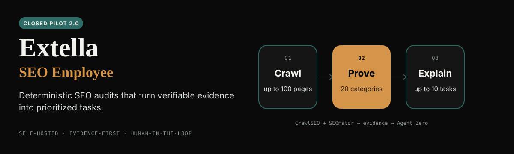
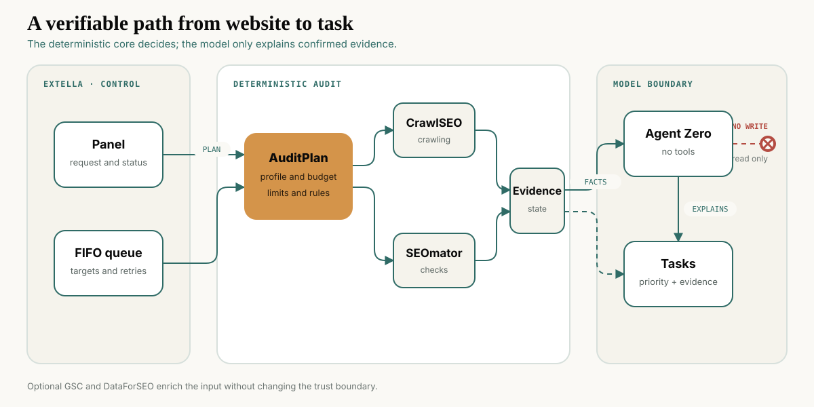

<p align="center">
  <a href="./README.md">Русский</a> · <strong>English</strong>
</p>

<p align="center">
  
</p>

**Extella SEO Employee 2.0** is a self-hosted SEO worker for agencies and specialists who need repeatable technical audits across multiple websites. On request or once a day, it collects data, checks it with two independent engines, and turns confirmed problems into clear tasks.

Status: **`SHIP_CLOSED_PILOT`**. The system is ready for a closed pilot, but is not yet presented as a public production service.

## What is verified

| Check | Result |
|---|---|
| Local tests | Python `181/181`; Node `62/64`, with 2 Linux-only tests skipped on Windows |
| Clean CT160 run | Python `181/181`; Node `64/64`; 7 services running and all 6 healthchecked services healthy |
| Full API E2E | CrawlSEO `25/25`; SEOmator `25/25` + 5 browser samples; Agent Zero `10/10`; 10 tasks created |
| Target safety | Private addresses are blocked at the actual fetch boundary; site ownership is confirmed before an audit |
| Independent review | OpenExecutive: `SHIP_CLOSED_PILOT`, severity `medium`; final Sol review: `REVIEW_APPROVED`, no P0/P1 |

Full verification record: [`dist/ct160-verification-v203.json`](https://github.com/kalpakprod/extella-seo-employee/blob/main/dist/ct160-verification-v203.json). Closed-pilot final audit: [`reviews/universal-seo-employee-v2-final-review.md`](./reviews/universal-seo-employee-v2-final-review.md).

## What the worker does

- Manages multiple isolated targets with separate history, baselines, and a FIFO queue.
- Runs an audit on demand or on a daily schedule.
- Supports `service_b2b`, `ecommerce`, `local_business`, `content_media`, and `saas_marketplace` profiles.
- Crawls from 1 to 100 pages, with 25 as the default.
- Combines deterministic CrawlSEO and SEOmator results into one evidence package.
- Gives Agent Zero sanitized facts only; the agent explains impact and the smallest fix without site-access tools.
- Preserves results when the model is unavailable: facts do not depend on generated text.

## Architecture

<p align="center">
  
</p>

1. The user adds an authorized public website and selects a profile.
2. `AuditPlan` freezes the page budget, rules, and sources before execution.
3. CrawlSEO and SEOmator independently produce evidence; queueing and state remain deterministic.
4. Agent Zero explains confirmed facts only. If the model is unavailable, the system preserves deterministic tasks and evidence without a model explanation.

Google Search Console and DataForSEO are optional data sources. Their absence does not block the free technical audit.

## Quick start

Requirements: Linux `amd64`, Docker Engine with Compose v2, Python 3.11+, and Git. From the project directory:

```sh
python3 tools/selfcheck.py
cp deploy/.env.example deploy/.env
python3 deploy/prepare.py \
  --device-id '<Extella device id>' \
  --hosting-profile client_server \
  --agent-id '<agent_... from Extella>'
docker compose --project-name extella-seo-release -f deploy/compose.yaml up -d
```

After startup, the owner opens Agent Zero at `http://127.0.0.1:50081`, connects a provider, and selects a model. Check the services with:

```sh
docker compose --project-name extella-seo-release -f deploy/compose.yaml ps
python3 deploy/probe.py health
python3 deploy/probe.py state
```

The product API listens only on `http://127.0.0.1:8088`. Hosting requires a separate TLS reverse proxy and external authentication. See [`deploy/README.md`](./deploy/README.md) for the complete procedure, including an existing Agent Zero deployment.

## OmniRoute model compatibility

On September 1, 2026, 16 canonical text models were tested through a live Agent Zero instance with the `seo_employee_no_tools` profile and the exact model-enrichment JSON contract.

| Status | Models |
|---|---|
| Full API E2E | `agy/gemini-3.7-flash-high` |
| Contract smoke test passed | `agy/gemini-3.7-flash-low`, `agy/gemini-3.1-pro-low`, `claude/claude-sonnet-5`, `claude/claude-opus-5`, `codex/gpt-5.6-luna-medium`, `codex/gpt-5.6-terra-medium`, `or/qwen/qwen3.7-flash`, `apipass/claude-opus-5` |
| Unstable | `gq/qwen/qwen3.6-27b`: one response violated the JSON contract; the retry passed |
| Route or response failure | `claude/claude-haiku-4-5-20251001`: incompatible OmniRoute thinking configuration; `codex/gpt-5.6-sol-medium`: Agent Zero stopped after five unusable responses |
| Timeout over 90 seconds | `nvidia/nvidia/nemotron-3-super-120b-a12b`, `qwen1/qwen3.7-plus`, `qwen2/qwen3.7-plus`, `xai-oauth/grok-4.5` |

The smoke test verifies Agent Zero transport and the format of one model-enrichment response. It does not replace a full audit through the product API. The OmniRoute catalog contains 2,299 aliases; batch, effort, image, audio, and other duplicates were not tested. Models outside this table remain unverified.

## Release boundaries

- The worker does **not** change the website, publish content, perform outreach, or buy links.
- Only `agy/gemini-3.7-flash-high` has passed a full API E2E. Other successful routes in the matrix still require their own full E2E; consumer subscriptions and BYOK remain unverified. There is no automatic model fallback.
- Google Search Console and DataForSEO OAuth, design-partner domain results, demand, ROI, revenue, and production SLA are not verified yet.
- The verdict covers a closed pilot, not a public production launch.

## Documentation

- [Feature Contract](./docs/contracts/feature-seo-audit-monitoring.md)
- [Service Contract](./docs/contracts/service-seo-runner.md)
- [UI Contract](./docs/contracts/ui-seo-panel.md)
- [System Blueprint](./docs/blueprints/system.md)
- [Universal Employee Blueprint](./docs/blueprints/universal-seo-employee-v2.md)
- [Requirements and test traceability](./docs/verification/traceability.md)
- [Investor one-page](./docs/investor/one-page.md)
- [Investor deck](./docs/investor/deck.md)
- [Third-party notices](./THIRD_PARTY_NOTICES.md)

## Build and checksums

`python3 tools/build_release.py` creates deterministic page and runtime ZIPs. Exact filenames and SHA-256 values for the latest local build are written to `dist/build.json`; published immutable versions are available from [GitHub Releases](https://github.com/kalpakprod/extella-seo-employee/releases).

Component licenses and terms are governed by their upstream projects. Required notices are preserved in [`THIRD_PARTY_NOTICES.md`](./THIRD_PARTY_NOTICES.md). A separate license review of the complete release bundle is required before commercial distribution.
