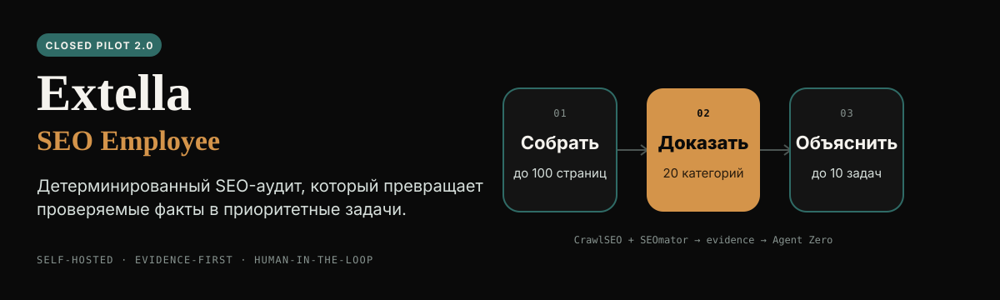
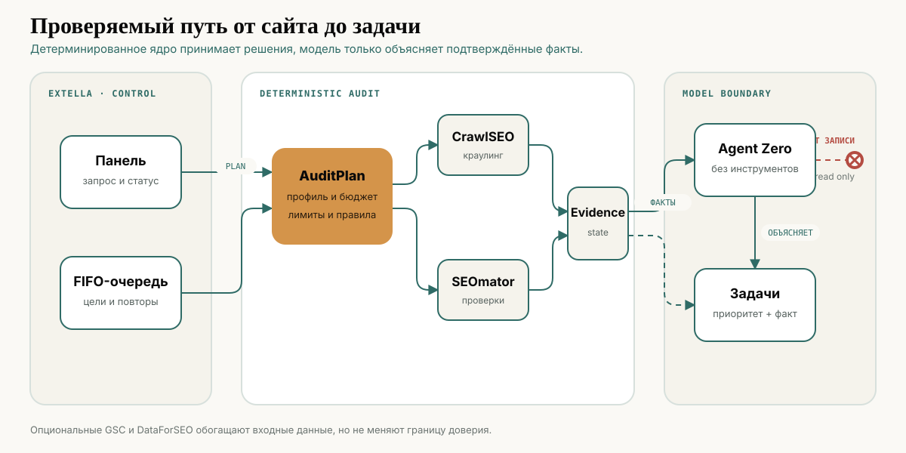

<p align="center">
  <strong>Русский</strong> · <a href="./README.en.md">English</a>
</p>

<p align="center">
  
</p>

**Extella SEO Employee 2.0** — self-hosted SEO-сотрудник для агентств и специалистов, которым нужен повторяемый технический аудит нескольких сайтов. Он по запросу или раз в сутки собирает данные, проверяет их двумя независимыми движками и превращает подтверждённые проблемы в понятные задачи.

Статус: **`SHIP_CLOSED_PILOT`**. Контур готов для закрытого пилота, но ещё не заявлен как публичный production-сервис.

## Что уже доказано

| Проверка | Результат |
|---|---|
| Локальные тесты | Python `168/168`; Node `62/64`, ещё 2 Linux-only теста пропущены на Windows |
| Чистый запуск на CT160 | Python `168/168`; Node `64/64`; 7 сервисов healthy |
| Полный API E2E | CrawlSEO `25/25`; SEOmator `25/25` + 5 browser samples; Agent Zero `10/10`; создано 10 задач |
| Безопасность цели | Приватные адреса блокируются на фактической границе загрузки; владение сайтом подтверждается до аудита |
| Независимая проверка | OpenExecutive: `SHIP_CLOSED_PILOT`, severity `low`; финальный Sol review: `REVIEW_APPROVED`, без P0/P1 |

Полный протокол: [`dist/ct160-verification-v2.json`](./dist/ct160-verification-v2.json). Финальный аудит: [`reviews/universal-seo-employee-v2-final-review.md`](./reviews/universal-seo-employee-v2-final-review.md).

## Что делает сотрудник

- Ведёт несколько изолированных целей с собственной историей, baseline и FIFO-очередью.
- Запускает аудит вручную или по ежедневному расписанию.
- Использует профили `service_b2b`, `ecommerce`, `local_business`, `content_media`, `saas_marketplace`.
- Обходит от 1 до 100 страниц, по умолчанию 25.
- Сводит детерминированные результаты CrawlSEO и SEOmator в единый evidence-пакет.
- Передаёт Agent Zero только очищенные факты; агент объясняет влияние и минимальное исправление без инструментов доступа к сайту.
- Сохраняет результаты даже при недоступной модели: факты не зависят от генерации текста.

## Архитектура

<p align="center">
  
</p>

1. Пользователь добавляет разрешённый публичный сайт и выбирает профиль.
2. `AuditPlan` фиксирует бюджет страниц, правила и источники до запуска.
3. CrawlSEO и SEOmator независимо создают доказательства; очередь и состояние остаются детерминированными.
4. Agent Zero объясняет только подтверждённые факты. Если модель недоступна, система сохраняет детерминированные задачи и доказательства без модельного объяснения.

Google Search Console и DataForSEO предусмотрены как опциональные источники. Их отсутствие не блокирует бесплатный технический аудит.

## Быстрый запуск

Требования: Linux `amd64`, Docker Engine с Compose v2, Python 3.11+ и Git. Из каталога проекта:

```sh
python3 tools/selfcheck.py
cp deploy/.env.example deploy/.env
python3 deploy/prepare.py \
  --device-id '<Extella device id>' \
  --hosting-profile client_server \
  --agent-id '<agent_... from Extella>'
docker compose --project-name extella-seo-release -f deploy/compose.yaml up -d
```

После запуска владелец открывает Agent Zero на `http://127.0.0.1:50081`, подключает провайдер и выбирает модель. Проверка сервисов:

```sh
docker compose --project-name extella-seo-release -f deploy/compose.yaml ps
python3 deploy/probe.py health
python3 deploy/probe.py state
```

API продукта доступен только на `http://127.0.0.1:8088`. Для хостинга нужен отдельный TLS reverse proxy и внешняя аутентификация. Полная инструкция, включая подключение существующего Agent Zero: [`deploy/README.md`](./deploy/README.md).

## Границы релиза

- Сотрудник **не** изменяет сайт, не публикует контент, не делает outreach и не покупает ссылки.
- Подтверждён маршрут `agy/gemini-3.7-flash-high`. Любая модель, пользовательская подписка и BYOK остаются неподтверждёнными до отдельного E2E; автоматического fallback между моделями нет.
- OAuth для Google Search Console и DataForSEO, результаты на домене design partner, спрос, ROI, выручка и production SLA пока не подтверждены.
- Вердикт относится к закрытому пилоту, а не к публичному production-запуску.

## Документация

- [Feature Contract](./docs/contracts/feature-seo-audit-monitoring.md)
- [Service Contract](./docs/contracts/service-seo-runner.md)
- [UI Contract](./docs/contracts/ui-seo-panel.md)
- [System Blueprint](./docs/blueprints/system.md)
- [Universal Employee Blueprint](./docs/blueprints/universal-seo-employee-v2.md)
- [Трассировка требований и тестов](./docs/verification/traceability.md)
- [Investor one-page](./docs/investor/one-page.md)
- [Investor deck](./docs/investor/deck.md)
- [Уведомления о сторонних компонентах](./THIRD_PARTY_NOTICES.md)

## Артефакты 2.0.0

| Артефакт | SHA-256 |
|---|---|
| [`extella-seo-employee-runtime-2.0.0.zip`](./dist/extella-seo-employee-runtime-2.0.0.zip) | `fe460f2b2e7a282d1ba6c367c55d601ada416ce69a20f57c740551e277c253a4` |
| [`extella-seo-employee-page-2.0.0.zip`](./dist/extella-seo-employee-page-2.0.0.zip) | `2e1530cc531b6ce3000b7193d3f89ccfc8b7974d4becfd2fcd387ec15befc832` |

Лицензии и условия использования компонентов определяются их исходными проектами. Уведомления сохранены в [`THIRD_PARTY_NOTICES.md`](./THIRD_PARTY_NOTICES.md). Перед коммерческим распространением нужен отдельный license review полного release bundle.
